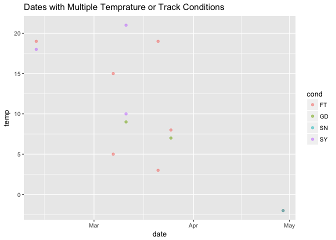
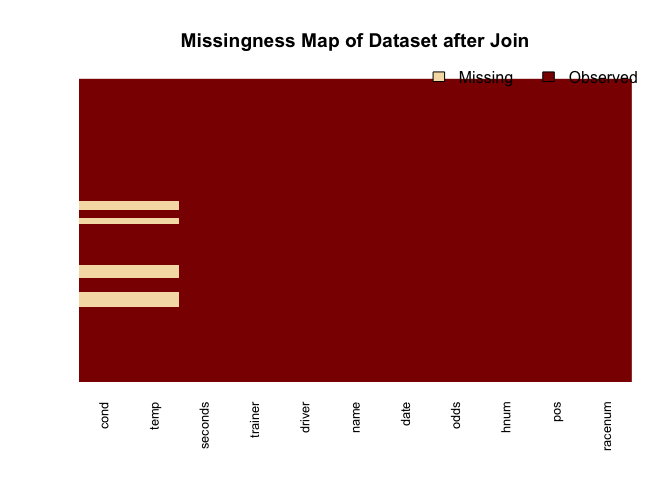
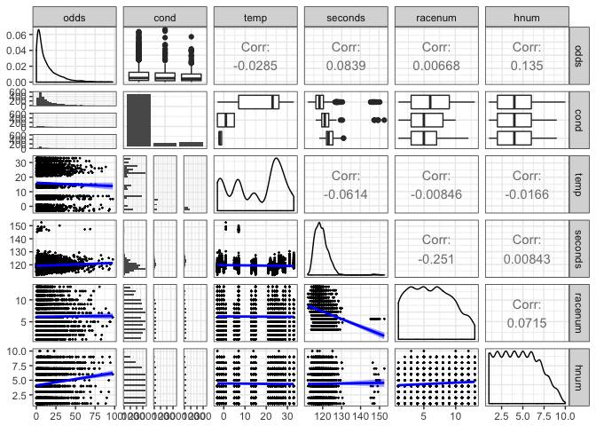
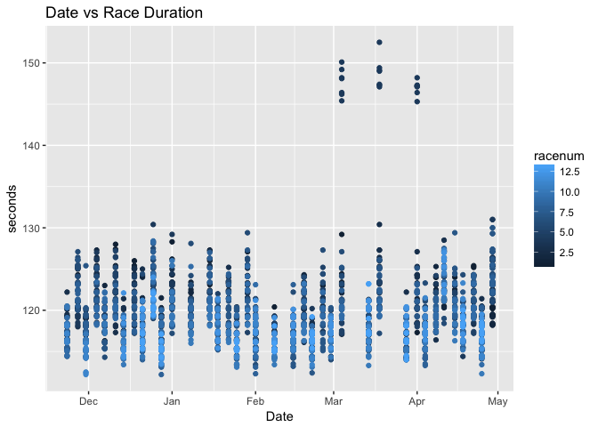

Race Winner Report
================
Cem Sinan Ozturk
2018-05-09

1. EDA (Exploratory Data Analysis) and Visualization
----------------------------------------------------

There are two datasets which are `Conditions3.csv` and `Results.csv` for previous results. In addition to these files, I added information table about the 9th race on 2016-04-29 in `final_race.txt` from README.

### Read Datasets:

``` r
# Read Condition3.csv and Results3.csv files into tibble objects:
conditions <- read_csv("Conditions3.csv")
results <- read_csv("Results3.csv")
# check if datasets are loaded correctly: 
head(conditions) %>% kable()
```

|  temp| cond | date       |
|-----:|:-----|:-----------|
|    24| FT   | 2015-11-23 |
|    26| FT   | 2015-11-27 |
|    24| FT   | 2015-11-30 |
|    27| FT   | 2015-12-04 |
|    28| FT   | 2015-12-07 |
|    33| FT   | 2015-12-11 |

``` r
head(results) %>% kable()
```

|  racenum|  pos|  hnum|   odds| date       | name    | driver    | trainer  |  seconds|
|--------:|----:|-----:|------:|:-----------|:--------|:----------|:---------|--------:|
|        1|    1|     2|  13.05| 2015-11-23 | Viviana | Harper    | Tessa    |    117.1|
|        1|    2|     6|   2.60| 2015-11-23 | Ryder   | Asher     | Quincy   |    116.2|
|        1|    3|     4|   6.95| 2015-11-23 | Easton  | Christina | Thomasin |    116.5|
|        1|    4|     5|   0.80| 2015-11-23 | Simon   | Kyle      | Yahir    |    115.3|
|        1|    5|     1|   4.85| 2015-11-23 | Ashlee  | Zane      | Carol    |    117.2|
|        1|    6|     3|   4.00| 2015-11-23 | Carmen  | Theresa   | Brian    |    117.4|

Final race information was given in README file. I copied the table into `final_race.txt` which is read in the following code chunk.

``` r
# Read the 9th race on 2016-04-29 information:
final_race <- read_table2(file="final_race.txt", col_names = TRUE, comment="=")
final_race  %>% kable() 
```

|  hnum|   odds| name    | driver    | trainer |
|-----:|------:|:--------|:----------|:--------|
|     1|  34.80| Ramon   | Asher     | Moises  |
|     3|  38.20| Jean    | Penelope  | Brynn   |
|     4|   7.10| Bryson  | Gabriella | Kyleigh |
|     5|  25.40| Gabriel | Estrella  | Elena   |
|     6|   4.10| Anthony | Theresa   | Maurice |
|     7|   3.25| Noe     | Beau      | Quincy  |
|     8|  16.10| Johnny  | Betty     | Carol   |
|     9|   0.50| Carter  | Kody      | Walter  |

### Summarize Datasets:

``` r
conditions %>% summary() %>% kable()
```

|     |      temp     |       cond       |        date        |
|-----|:-------------:|:----------------:|:------------------:|
|     |  Min. :-3.00  |     Length:49    |  Min. :2015-11-23  |
|     | 1st Qu.: 7.00 | Class :character | 1st Qu.:2016-01-08 |
|     | Median :15.00 |  Mode :character | Median :2016-02-26 |
|     |  Mean :14.82  |        NA        |  Mean :2016-02-16  |
|     | 3rd Qu.:24.00 |        NA        | 3rd Qu.:2016-03-25 |
|     |  Max. :33.00  |        NA        |  Max. :2016-04-29  |

``` r
# unique values for track conditions:
unique(conditions$cond) 
```

    ## [1] "FT" "SY" "GD" "SN"

Conditions dataframe has 49 entries with `temp` (temperature) values ranging from -3 to 33 C, and `date` variable from "2015-11-23" to "2016-04-29" which is the date for final race to be predicted. Also `cond` (track condition) variable has four different conditions which are "FT"(fast), "SY"(sloppy), "GD"(good), and "SN"(snowy).

``` r
results %>% summary()
```

    ##     racenum           pos            hnum             odds      
    ##  Min.   : 1.00   Min.   :1.00   Min.   : 1.000   Min.   : 0.05  
    ##  1st Qu.: 3.00   1st Qu.:2.00   1st Qu.: 2.000   1st Qu.: 3.05  
    ##  Median : 6.00   Median :4.00   Median : 4.000   Median : 7.65  
    ##  Mean   : 6.19   Mean   :4.22   Mean   : 4.402   Mean   :13.20  
    ##  3rd Qu.: 9.00   3rd Qu.:6.00   3rd Qu.: 6.000   3rd Qu.:18.05  
    ##  Max.   :13.00   Max.   :9.00   Max.   :10.000   Max.   :97.60  
    ##       date                name              driver         
    ##  Min.   :2015-11-23   Length:3351        Length:3351       
    ##  1st Qu.:2015-12-28   Class :character   Class :character  
    ##  Median :2016-02-15   Mode  :character   Mode  :character  
    ##  Mean   :2016-02-12                                        
    ##  3rd Qu.:2016-03-25                                        
    ##  Max.   :2016-04-29                                        
    ##    trainer             seconds     
    ##  Length:3351        Min.   :112.1  
    ##  Class :character   1st Qu.:117.0  
    ##  Mode  :character   Median :119.1  
    ##                     Mean   :119.5  
    ##                     3rd Qu.:121.2  
    ##                     Max.   :152.5

Results dataframe has 3351 entries with 9 variables which are `racenum` (number of the race in the day), `pos`(finishing position), `hnum` (horse number), `odds`(odds for the horse), `date`, `seconds`(the time to finish the race), `name` (name of the horse), `driver`(name of the driver), `trainer`(name of the trainer).

### Check Missing Values:

``` r
# check if there are any na values in both datasets:
sum(is.na(conditions))
```

    ## [1] 0

``` r
sum(is.na(results))
```

    ## [1] 0

We do not have any missing values for the datasets.

### Multiple Conditions per Day:

``` r
# check if we have multiple cond and temp entries for a single day:
multiple_cond <- conditions %>% 
  group_by(date) %>% 
  summarise(date_count = n()) %>%
  filter(date_count>1)
```

``` r
# Check out the dates with multiple cond and/or temp entries:
multiple_cond %>% kable()
```

| date       |  date\_count|
|:-----------|------------:|
| 2016-02-12 |            2|
| 2016-03-07 |            2|
| 2016-03-11 |            3|
| 2016-03-21 |            2|
| 2016-03-25 |            2|
| 2016-04-29 |            2|

We have six dates with multiple track condition and/or temperature values for a single day. I visualize it to get a better sense of it.

``` r
conditions %>% filter(date %in% multiple_cond$date) %>%
  ggplot() + geom_point(aes(date, temp, color = cond), alpha = 0.5) +
  ggtitle("Dates with Multiple Temprature or Track Conditions")
```



Dropping is not the best way but it the fastest way to deal with the multiple entries. However, if I had more time, I could have tried to explore this multiple entry cases.

``` r
# drop "2016-04-29" since it is the day for our final race:
multiple_cond <- multiple_cond %>%
  filter(date != "2016-04-29")
# drop other multiple_cond dates from conditions:
conditions <- conditions %>% 
  filter(!(date %in% multiple_cond$date)) 
# It is a jugdement call! Keep cond for this date as "SN":
conditions$cond[conditions$date == "2016-04-29"] <- "SN"
```

As we have the latest race in this day I will keep the condition for this day as *"SN"(snowy)* not *"FT"(fast)*. If it starts snowing during the day track will be affected by the snow.

### Join Datasets:

``` r
# Join conditions data into results
dat <- dplyr::left_join(results, conditions, by = "date")
```

``` r
# Glimpse joined data: 
dat %>% glimpse()
```

    ## Observations: 3,411
    ## Variables: 11
    ## $ racenum <int> 1, 1, 1, 1, 1, 1, 2, 2, 2, 2, 2, 2, 2, 3, 3, 3, 3, 3, ...
    ## $ pos     <int> 1, 2, 3, 4, 5, 6, 1, 2, 3, 4, 5, 6, 7, 1, 2, 3, 4, 5, ...
    ## $ hnum    <int> 2, 6, 4, 5, 1, 3, 3, 7, 2, 4, 5, 6, 1, 4, 7, 1, 2, 8, ...
    ## $ odds    <dbl> 13.05, 2.60, 6.95, 0.80, 4.85, 4.00, 12.00, 4.40, 24.8...
    ## $ date    <date> 2015-11-23, 2015-11-23, 2015-11-23, 2015-11-23, 2015-...
    ## $ name    <chr> "Viviana", "Ryder", "Easton", "Simon", "Ashlee", "Carm...
    ## $ driver  <chr> "Harper", "Asher", "Christina", "Kyle", "Zane", "There...
    ## $ trainer <chr> "Tessa", "Quincy", "Thomasin", "Yahir", "Carol", "Bria...
    ## $ seconds <dbl> 117.1, 116.2, 116.5, 115.3, 117.2, 117.4, 116.4, 117.3...
    ## $ temp    <int> 24, 24, 24, 24, 24, 24, 24, 24, 24, 24, 24, 24, 24, 24...
    ## $ cond    <chr> "FT", "FT", "FT", "FT", "FT", "FT", "FT", "FT", "FT", ...

``` r
# check if there are any missing values after left_join:
sum(is.na(dat))
```

    ## [1] 952

We can see that there are missing values after I join `conditions` and `results` dataframes. It was what I expected since I had dropped some rows from `conditions` due to mutliple condition per day.

``` r
# Visualise the missing values:
missmap(dat,
 main = "Missingness Map of Dataset after Join",
 y.labels = NULL,
 y.at = NULL)
```



First, I drop the days that I dropped due to multiple conditions.

``` r
dat <- dat %>% 
  filter(!(date %in% multiple_cond$date)) 
```

### Missing Value Check After Join:

``` r
# Find out values around "2016-02-01": 
dat %>% filter(is.na(cond) == T) %>% 
  select(date,cond,temp) %>%
  unique() %>% 
  kable()
```

| date       | cond |  temp|
|:-----------|:-----|-----:|
| 2016-02-01 | NA   |    NA|

As we can see, we only have missing values on "2016-02-01" after I drop the days for multiple entries. We could have dropped this one too but as it is only one date we may interpolate by looking at the other dates around this date. Below, I summarize 15 days before and after "2016-02-01".

``` r
# Find out the date of Missing Value: 
dat %>% filter(date > "2016-01-16" & date <"2016-02-16") %>% select(date,cond,temp) %>% unique()
```

    ## # A tibble: 7 x 3
    ##   date       cond   temp
    ##   <date>     <chr> <int>
    ## 1 2016-01-18 FT       28
    ## 2 2016-01-22 FT       22
    ## 3 2016-01-25 FT       25
    ## 4 2016-01-29 FT       26
    ## 5 2016-02-01 <NA>     NA
    ## 6 2016-02-08 FT       21
    ## 7 2016-02-15 FT       13

We can see that there is a decreasing fashion in the temperature and if we interpolate values around this date, we may use 24 as an estimate for `temp` to fill NA. For condition variable, track condition is "FT" (fast) from "2016-01-18" to "2016-02-15" so I will impute `cond` variable as "FT".

``` r
# Fill missing values for "2016-02-01": 
dat$cond[dat$date == "2016-02-01"] <- "FT"
dat$temp[dat$date == "2016-02-01"] <- 24
```

Visualize Data:
---------------

First of all, I will use `ggpairs` to get quick multiple visualizations. It is not the best-looking visualization but it is pretty efficient for a short amount of time.

``` r
# Function to pass into (to get a linear line and smaller points as default is not printing legible results)
g_fun <- function(data, mapping, ...){
  p <- ggplot(data = data, mapping = mapping) + 
    geom_point(size =0.25) + 
    geom_smooth(method=lm, fill="blue", color="blue", ...)
  p
}
# Get ggpairs plots for "odds", "cond", "temp","seconds", "racenum","hnum", "pos" variables:
g <-  suppressMessages(ggpairs(dat,
              columns = c("odds", "cond", "temp","seconds", "racenum","hnum"),
              lower = list(continuous =  wrap(g_fun, binwidth = c(5, 0.5)))) + 
  theme_bw())

suppressMessages(print(g)) # to get rid of message used suppressMessages(print(...))
```



Although we do not have all numerical variables, the correlation may still be useful to have an idea. As we can see from `ggpair` plot, we do not have a high level of correlation, multicollinearity is not our primary concern.

Above, we can see `seconds` and `cond` would be interesting to plot to explore. There is obviously a race number which has higher time values.

``` r
dat %>% ggplot() + 
  geom_point(aes(date, 
                 seconds,
                 color = racenum))+
  xlab("Date") +
  xlab("Date") +
  ggtitle("Date vs Race Duration")
```



We can see more clearly that there is a `racenum` which has longer race duration. We may exclude it since it seems like it is a different type of race.

``` r
dat %>% filter(seconds > 140) %>% select(racenum) %>% unique() %>% kable()
```

|  racenum|
|--------:|
|        4|

``` r
# drop racenum 4: 
dat <- dat %>% filter(racenum != 4)
```

``` r
final_race["cond"] <- unique(dat$cond[dat$date== "2016-04-29"])
final_race["temp"] <- unique(dat$temp[dat$date== "2016-04-29"])
final_race["date"] <- "2016-04-29"
```

I will also drop the rows which have all different horse, driver, and trainer from the final race which will leave us only related `trainer`, `name`, and `driver` variables. If we have neither of them, it will provide any extra information for our race.

``` r
dat <- dat %>% 
  filter(driver %in% final_race$driver |
           name %in% final_race$name |
           trainer %in% final_race$trainer)
print(paste("Number of rows for the final subset data is", nrow(dat)))
```

    ## [1] "Number of rows for the final subset data is 1533"

2. Fit a Model
--------------

### Logistic Regression

The first simple model would be fitting a logistic regression. For a logistic regression, we need a binary response variable so I create `winner` variable. Then, we can classify each entry as `winner` or not based the `pos` variable. I tried `glm` version for the Logistic Regression but it did not give me converging results so I will use `nnet` package for logistic regression and multinomial logistic regression. Since I use `winner` binary variable as the response variable. It will fit the binary case of multinomial logistic regression which is the logistic regression.

``` r
# create the winner variable:
dat <- dat %>% mutate(winner = ifelse(pos == 1 , 1, 0))
```

I use horse number, horse name, driver, trainer, track condition, temperature and date as explanatory variables. If I had more time, I can do more detailed significance analysis for each explanatory variable, and multicollinearity between variables.

### Split Data into Train and Test:

As splitting train and test into with multiple factors is a challenge. I decided to fit split data into train and test in Python and fit `LogisticRegression` models with `sklearn` into train and test data to calculate accuracy scores.

``` r
# Write subset data into feather to read in Python:  
path <- "sub_data.feather"
write_feather(dat, path)
```

To access Python notebook file: [model\_fit.ipynb](./model_fit.ipynb) for the code. I also saved this notebook as md file which can be found, [here](./model_fit.md)

### Train and Test Accuracy Score from `sklearn` Logistic Regression Implementation:

    > Logistic Regression training error: 0.185971
    > Logistic Regression test error: 0.156352

It predicts all the horses as "not winner" in `sklearn` implementation. However, we may still make use of the probabilities for each horse being a winner or not.

### `multinom` Logistic Regression Implementation

We can try to fit and predict `multinom` function as it does give us the probability of `winner` variable. We can directly use these probabilities without making hard assignments.

``` r
# Run the Logistic model:
# `multinom` function for logistic regression for binary response:
log_model <- multinom(winner ~ as.factor(hnum) + name + driver +
                      trainer + cond + temp + as.factor(date),
                      data=dat, trace = FALSE)
# summary(log_model) # as there are too many levels it is not feasible to print

pred_probs <- predict(log_model,final_race,"probs")
final_probs <- data_frame(name = final_race$name, pred_probs, odds = final_race$odds)

# Normalize probabilities of each horse to be winner or not to make total probality 1:
final_probs <-final_probs %>% mutate(pred_probs = pred_probs/sum(pred_probs))
final_probs %>% mutate(expected_return = pred_probs*odds-1) %>% kable()
```

| name    |  pred\_probs|   odds|  expected\_return|
|:--------|------------:|------:|-----------------:|
| Ramon   |    0.0470390|  34.80|         0.6369568|
| Jean    |    0.0000000|  38.20|        -1.0000000|
| Bryson  |    0.2051729|   7.10|         0.4567276|
| Gabriel |    0.0000000|  25.40|        -1.0000000|
| Anthony |    0.1215949|   4.10|        -0.5014607|
| Noe     |    0.2125975|   3.25|        -0.3090583|
| Johnny  |    0.0000000|  16.10|        -1.0000000|
| Carter  |    0.4135957|   0.50|        -0.7932021|

As we can see from the table above, according to logistic regression, only Ramon and Bryson are the ones has positive returns. Based on this simple model, I would bet on these horses.

### Multinomial Logistic Regression

I will use `pos` (position) variable to fit multinomial logistic regression.

### Train and Test Accuracy Score from `sklearn` Logistic Regression Implementation:

    > Multinomial Logistic Regression training error: 0.798695
    > Multinomial Logistic Regression test error: 0.843478

We see logistic regression test error is 0.15 while multinomial logistic regression test is 0.84 which does not mean logistic regression is better than multinomial logistic regression. We get high accuracy score since the mode of the `winner` variable is zero and model is predicting every horse as not winner.

### `multinom` Multinomial Logistic Regression Implementation

``` r
# Run the Multinomial model:
# `multinom` function for logistic regression for binary response:
multinom_model <- multinom(pos~as.factor(hnum)+ name + driver +
                           trainer + cond + temp + as.factor(date),
                           data=dat, MaxNWts = 7000, trace = FALSE)
# Probabilities of positions:
pred_probs_mul <- predict(multinom_model,final_race,"probs")
# Probabilities of being the winner for all horses can be extracted from: pred_probs_mul[,1]

# create a dataframe to summarize final probabilities:
final_probs_multi <- data_frame(name = final_race$name, pred_probs = pred_probs_mul[,1],
                                odds = final_race$odds)
# Normalize winning probabilities:
final_probs_multi <- final_probs_multi %>% mutate(pred_probs = pred_probs/sum(pred_probs))
# summary table with expected return for Softmax Model:
final_probs_multi %>% mutate(expected_return = pred_probs*odds-1) %>% kable()
```

| name    |  pred\_probs|   odds|  expected\_return|
|:--------|------------:|------:|-----------------:|
| Ramon   |    0.0326654|  34.80|         0.1367550|
| Jean    |    0.0000000|  38.20|        -0.9999998|
| Bryson  |    0.2990363|   7.10|         1.1231575|
| Gabriel |    0.0740237|  25.40|         0.8802016|
| Anthony |    0.0508982|   4.10|        -0.7913174|
| Noe     |    0.2653215|   3.25|        -0.1377052|
| Johnny  |    0.0000000|  16.10|        -0.9999998|
| Carter  |    0.2780550|   0.50|        -0.8609725|

According to multinomial logistic regression, only Ramon, Bryson and Gabriel are the ones has positive returns but Bryson has the most positive expected return. Based on this model, I would bet on these three horses with high weights on Bryson and Gabriel.

3. Further Improvements
-----------------------

First of all, it is better to find a way to make use of the I drop due to the conflicting entries in `conditions` dataset. For example, it may be a good idea to find another hourly whether source to incorporate with the data we have and get more granular conditions by matching the time of `racenum` for each day.

Secondly, I use logistic regression to find horses to be `winner` or not, and I scaled these probabilities to get total probability as 1. It is a simple approach and it needs improvements as we can see from the results above. Then, I extended into softmax regression by using `pos`(position) variable as a response. This one also did not have high prediction power in our implementation.

I have used `ggpair` to maximize my speed. However, standard `ggplot` for all the variables would be more efficient and informative. Moreover, a Shiny Dashboard can be built to make interactive visualizations and better insights for horse betting.

Also, other types of predictive classification models can be performed such as random forest, Multi-class Support Vector Machine (SVM), multilayer neural networks and so on. Random forest will probably produce an overfitted model, and I would be hard to interpret multi-layer neural networks. Softmax is considered as a single neural network but it is still interpretable since it is a single layer model. Naive Bayes is another way to tackle with classification problem. It constructs "probability" of a class happening based Bayes rule, but it assumes features to be conditionally independent.

Last but not least, if I had more time, I could have worked on making the analysis reproducible by automating some processes for similar works.
